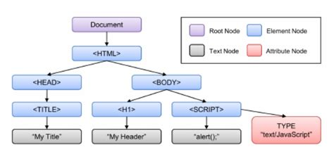

# Introduction to the DOM

The Document Object Model (DOM) is the data representation of the objects that comprise the structure and content of a document on the web. This guide will introduce the DOM, look at how the DOM represents an HTML document in memory and how to use APIs to create web content and applications.
What is the DOM?

The Document Object Model (DOM) is a programming interface for web documents. It represents the page so that programs can change the document structure, style, and content. The DOM represents the document as nodes and objects; that way, programming languages can interact with the page.

A web page is a document that can be either displayed in the browser window or as the HTML source. In both cases, it is the same document but the Document Object Model (DOM) representation allows it to be manipulated. As an object-oriented representation of the web page, it can be modified with a scripting language such as JavaScript.

# Fundamental data types

# Core DOM APIS
The following is a brief list of common APIs in web and XML page scripting using the DOM.

- document.querySelector(selector)
- document.querySelectorAll(name)
- document.createElement(name)
- parentNode.appendChild(node)
- element.innerHTML
- element.style.left
- element.setAttribute()
- element.getAttribute()
- element.addEventListener()
- window.content
- Window.onload
- window.scrollTo()
